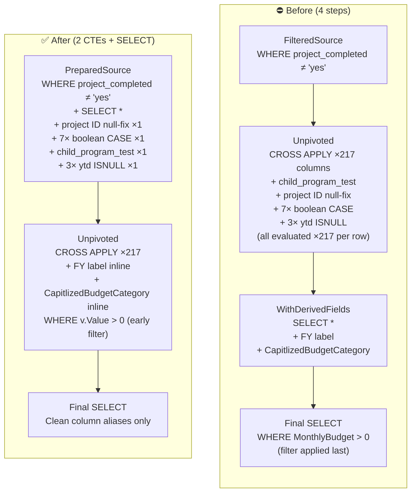

# DataForRisk SQL — Bug Fix & Optimisation

> **Context:** SQL query supporting the Infrastructure Plan Power BI report at Melton City Council.  
> Replicates the `ConsolidatedData` and `DataForRisk` Power Query transformation steps in pure T-SQL, enabling direct export to CSV from SSMS without depending on the Power Query refresh chain.

---

## Table of Contents

- [Background](#background)
- [The Bug — Msg 245 Conversion Error](#the-bug--msg-245-conversion-error)
  - [Root Cause](#root-cause)
  - [Fix Applied](#fix-applied)
- [Optimisations](#optimisations)
  - [Architecture: Before vs After](#architecture-before-vs-after)
  - [Pre-Computing Before the Unpivot Explosion](#pre-computing-before-the-unpivot-explosion)
  - [Eliminating the WithDerivedFields CTE](#eliminating-the-withDerivedFields-cte)
  - [Pushing the Budget Filter Upstream](#pushing-the-budget-filter-upstream)
- [Performance Impact Summary](#performance-impact-summary)
- [Data Source & Schema Notes](#data-source--schema-notes)
- [Usage](#usage)
- [Index Recommendation](#index-recommendation)
- [Files](#files)

---

## Background

The source table `dbo.Fulcrum_Infrastructure_Pipeline` is populated from **Fulcrum**, a mobile field data collection platform used to capture infrastructure projects across the municipality. The table has a wide schema: every combination of **funding type** (`rates`, `grant`, `reserve`, `dcpicp`, `loan`, `cf`, `labour`) and **financial year** (`13_14` through `43_44`) is stored as its own column — **217 financial columns in total**.

The query's job is to:

1. Filter out completed projects
2. Unpivot all 217 financial columns into long/tidy format (one row per project per funded year per funding type)
3. Derive human-readable labels (`FY`, `CapitlizedBudgetCategory`)
4. Translate boolean risk flags (`chmp`, `conservation`, `risk_bushfire`, etc.) into `Yes`/`No` display values
5. Output only rows with a non-zero budget allocation

This long-format result feeds directly into the **Infrastructure Plan Power BI report's** risk overlay visuals and financial timeline charts.

---

## The Bug — Msg 245 Conversion Error

Running the original script produced the following error:

```
Msg 245, Level 16, State 1, Line 8
Conversion failed when converting the varchar value 'FALSE' to data type int.
Completion time: 2026-06-15T14:36:44.0586928+10:00
```

### Root Cause

The boolean/flag columns in the Fulcrum export — `_isprogram`, `chmp`, `conservation`, `drystonewalls`, `native_veg_2005`, `100yr_flood_waterways`, `risk_bushfire`, and `dcpicp_land` — are stored as **`varchar`** containing the string values `'TRUE'` and `'FALSE'`. This is standard behaviour for Fulcrum's data export format.

The original script was written assuming these columns were **`bit` or `int`** (0/1), using the pattern:

```sql
CASE WHEN ISNULL([chmp], 0) = 1 THEN 'Yes' ELSE 'No' END
```

SQL Server's type precedence rules determine that when comparing a `varchar` expression to an `int`, it attempts to **cast the `varchar` to `int`**. The sequence of events:

| Step | What happens |
|---|---|
| `[chmp]` contains `'FALSE'` (not NULL) | `ISNULL([chmp], 0)` returns `'FALSE'` (varchar) |
| Compare `'FALSE' = 1` | SQL Server tries to cast `'FALSE'` → `int` |
| **FAIL** | `Msg 245` — `'FALSE'` cannot be converted to `int` |

The same pattern appeared in **8 places** across the script:

- `ISNULL([_isprogram], 0) = 1` — in the `child_program_test` CASE logic (`Unpivoted` CTE)
- `ISNULL([chmp], 0) = 1` — final SELECT
- `ISNULL([conservation], 0) = 1` — final SELECT
- `ISNULL([drystonewalls], 0) = 1` — final SELECT
- `ISNULL([native_veg_2005], 0) = 1` — final SELECT
- `ISNULL([100yr_flood_waterways], 0) = 1` — final SELECT
- `ISNULL([risk_bushfire], 0) = 1` — final SELECT
- `ISNULL([dcpicp_land], 0) = 1` — final SELECT

> **Why Line 8?** SQL Server reports `Line 8` (the `WITH` keyword) for CTE-level conversion errors — a known SSMS quirk where the error points to the start of the batch statement rather than the specific expression inside a CTE.

### Fix Applied

All eight occurrences were replaced with a varchar-safe comparison:

```sql
-- BEFORE (assumes bit/int column):
CASE WHEN ISNULL([chmp], 0) = 1 THEN 'Yes' ELSE 'No' END

-- AFTER (handles varchar 'TRUE'/'FALSE' from Fulcrum):
CASE WHEN UPPER(ISNULL([chmp], '')) = 'TRUE' THEN 'Yes' ELSE 'No' END
```

`UPPER()` is a defensive wrapper — if Fulcrum ever exports `'true'` or `'True'` instead of `'TRUE'`, the comparison still resolves correctly.

---

## Optimisations

After fixing the bug, the script was restructured for efficiency. The original had **4 sequential steps**; the optimised version has **2 CTEs + a final SELECT**.

### Architecture: Before vs After



---

### Pre-Computing Before the Unpivot Explosion

This is the most impactful optimisation.

The CROSS APPLY unpivots 217 financial columns, creating **217 rows per source project row**. Any expression evaluated inside `Unpivoted` is therefore computed **217 times per project**. The original script placed 10 non-trivial expressions inside the unpivot:

| Expression | Times evaluated (original) | Times evaluated (optimised) |
|---|---|---|
| `_project_id_forreport` null-fix | ×217 per row | **×1 per row** |
| `chmp` boolean CASE | ×217 per row | **×1 per row** |
| `conservation` boolean CASE | ×217 per row | **×1 per row** |
| `drystonewalls` boolean CASE | ×217 per row | **×1 per row** |
| `native_veg_2005` boolean CASE | ×217 per row | **×1 per row** |
| `100yr_flood_waterways` boolean CASE | ×217 per row | **×1 per row** |
| `risk_bushfire` boolean CASE | ×217 per row | **×1 per row** |
| `dcpicp_land` boolean CASE | ×217 per row | **×1 per row** |
| `child_program_test` CASE | ×217 per row | **×1 per row** |
| `ytd_*` ISNULL wrappers (×3) | ×217 per row | **×1 per row** |

The fix is the `PreparedSource` CTE, which uses `SELECT *` to carry all 217 financial columns forward without listing them explicitly, while adding all pre-computed expressions as **named computed columns** (with `_yn`, `_clean`, `_safe` suffixes to avoid naming conflicts with the originals):

```sql
PreparedSource AS (
    SELECT
        *,
        -- Evaluated ONCE per project row, not ×217
        CASE WHEN NULLIF(LTRIM(RTRIM(ISNULL([_project_id_forreport], ''))), '') IS NULL
             THEN [fulcrum_id] ELSE [_project_id_forreport]
        END AS [_project_id_clean],

        CASE WHEN UPPER(ISNULL([chmp], '')) = 'TRUE' THEN 'Yes' ELSE 'No' END AS [chmp_yn],
        -- ... (all 7 boolean flags + child_program_test + ytd wrappers)

    FROM [dbo].[Fulcrum_Infrastructure_Pipeline]
    WHERE ISNULL([project_completed], '') <> 'yes'
)
```

`Unpivoted` then references `p.[chmp_yn]`, `p.[_project_id_clean]` etc. — the already-resolved values — rather than re-evaluating the expressions per financial column row.

---

### Eliminating the WithDerivedFields CTE

The original `WithDerivedFields` CTE did nothing except `SELECT *` from `Unpivoted` and add two string-derivation columns:

```sql
-- Original WithDerivedFields — entire body:
SELECT *,
    REPLACE(RIGHT([ColName], 5), '_', '/')  AS [FY],
    CASE LEFT([ColName], CHARINDEX('_', [ColName]) - 1)
        WHEN 'rates' THEN 'Council Rates'
        ...
    END AS [CapitlizedBudgetCategory]
FROM Unpivoted
```

This meant SQL Server materialised `Unpivoted` fully, then scanned it again to add two columns. In the optimised version, `FY` and `CapitlizedBudgetCategory` are derived **directly in the `Unpivoted` SELECT list**, eliminating the extra pass entirely.

---

### Pushing the Budget Filter Upstream

The original filtered zero-budget rows at the very end:

```sql
-- Original: filter at the final SELECT, after full expansion
FROM WithDerivedFields
WHERE [MonthlyBudget] > 0
```

The optimised version filters inside `Unpivoted`, immediately after the CROSS APPLY:

```sql
-- Optimised: filter as soon as rows are produced
FROM PreparedSource p
CROSS APPLY (...) AS v([ColName], [Value])
WHERE v.[Value] > 0
```

**Behavioural equivalence:** `ISNULL(v.[Value], 0) > 0` (original) and `v.[Value] > 0` (optimised) are identical in effect — `NULL > 0` evaluates to `UNKNOWN` (false) in SQL Server, so NULL rows are excluded either way. The difference is *when* the exclusion happens: upstream filtering means the FY derivation, CapitlizedBudgetCategory CASE, and final SELECT column list are never evaluated for zero-budget rows.

---

## Performance Impact Summary

| Metric | Before | After |
|---|---|---|
| CTE count | 4 (FilteredSource → Unpivoted → WithDerivedFields → final) | 2 + final SELECT |
| Full row-scan passes | 4 | 2 |
| Boolean flag evaluations per source row | 7 × 217 = **1,519** | 7 × 1 = **7** |
| Scalar expressions evaluated per row (total) | ~10 × 217 = **~2,170** | ~10 × 1 = **~10** |
| Zero-budget row filter applied at | Final SELECT (last step) | Inside Unpivoted (earliest possible) |

> **Note:** SQL Server's query optimiser may already fold some of these CTEs at the execution plan level depending on statistics and indexes. The optimised query makes the intent explicit and guarantees the efficient shape regardless of optimiser behaviour.

---

## Data Source & Schema Notes

| Column group | Type in Fulcrum export | Notes |
|---|---|---|
| `_isprogram`, `chmp`, `conservation`, `drystonewalls`, `native_veg_2005`, `100yr_flood_waterways`, `risk_bushfire`, `dcpicp_land` | `varchar` — values `'TRUE'` / `'FALSE'` | Fulcrum stores all boolean fields as string literals. Do **not** compare to `0`/`1`. |
| `rates_YY_YY` … `labour_YY_YY` (217 cols) | Numeric (money/decimal) | Null = unfunded for that year/type. Treated as 0 for budget purposes. |
| `project_completed` | `varchar` — value `'yes'` when complete | Case-insensitive in the filter for safety. |
| `_project_id_forreport` | `varchar` — nullable | Falls back to `fulcrum_id` when null/blank. |
| `ytd_expenditure`, `ytd_forecast`, `ytd_total` | Numeric — nullable | Null-safe via `ISNULL(..., 0)`. |

**Financial year column naming convention:**  
`{funding_type}_{YY}_{YY}` — e.g. `rates_24_25` = Council Rates budget for FY 2024/25.  
The `FY` derived column strips the funding type prefix and formats as `24/25`.

---

## Usage

1. Open **SQL Server Management Studio (SSMS)** and connect to the database hosting `dbo.Fulcrum_Infrastructure_Pipeline`.
2. Open `DataForRisk_optimised.sql`.
3. Execute (`F5`).
4. When results appear: **right-click the results grid → Save Results As → CSV**.
5. The CSV can then be imported into Power BI as a replacement for the Power Query `DataForRisk` step.

**Column output matches the original Power Query shape** — downstream Power BI measures, relationships, and visuals require no changes.

---

## Index Recommendation

For larger datasets, a filtered index on `project_completed` will accelerate the `PreparedSource` filter:

```sql
CREATE INDEX IX_FulcrumPipeline_NotCompleted
ON dbo.Fulcrum_Infrastructure_Pipeline (project_completed)
INCLUDE (fulcrum_id, _project_id_forreport, public_name)
WHERE project_completed <> 'yes';
```

This is optional for typical council pipeline volumes (hundreds to low-thousands of rows) but worthwhile if the table grows or the query is scheduled to run automatically.

---

## Files

```
├── DataForRisk_optimised.sql   # Corrected + optimised query (use this)
└── README.md                   # This file
```

---

*Melton City Council — Planning Integration & Innovation*  
*Infrastructure Plan Power BI Report — DataForRisk pipeline*
